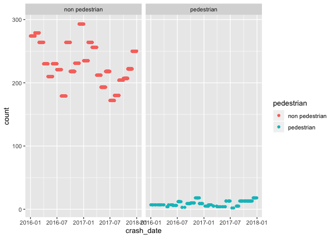
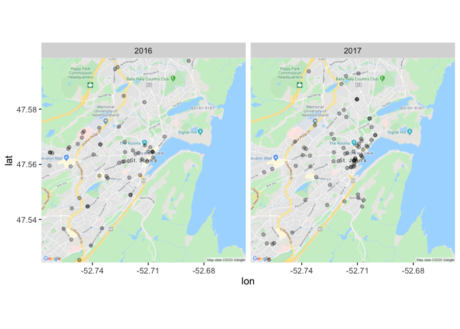

```r
knitr::opts_chunk$set(echo = TRUE)
library(tidyverse)
library(readxl)
library(lubridate)
library(knitr)
library(zoo)
library(ggmap)
library(rgdal)
library(sp)
library(sf)
```

# Analysis of St. John's Police Report data 2016 and 2017

These are data were provided to me by the Registrar of Motor Vehicles as compiled by the NL Statistics Agency. I did not receive a data dictionnary or information about the the detailed definition for each specific column. As a result, my process will be try and walk the reader through my logic and be as open and transparent as possible about the results. 

If you have thoughts or suggestions for the analysis I am open to suggestions. If you think I have made incorrect assumptions or made a mistake in my code please contact me. I will do my best to respond in a timely manner. 

## Data Usage Notes: 

1. Date extracted March 1, 2018.
2. Data content reflects collision reports received and processed to date noted.
3. Source: Compiled by the Road Network Management Group, Newfoundland and Labrador Statistics Agency from the Collision Database Management System (CDMS), Government of Newfoundland and Labrador.	

## Reading in the data 


```r
crashes_2016 <- read_excel("2016.xlsx")
crashes_2017 <- read_excel("2017.xlsx")

crashes <- rbind(crashes_2016, crashes_2017)
```

## Check for duplicates 


```r
crashes <- crashes %>% 
      distinct()
```

There are 16381 unique observations in the data. 

## Check and clean variables

#### Convert time to proper format and extract year and month


```r
crashes$crash_date <- ymd(crashes$AccidentDate)
crashes$year <- year(crashes$crash_date)
crashes$month <- month(crashes$crash_date)
```

#### Select only St. John's


```r
crash_sj <- subset(crashes, CollisionMunicipality == "St. John's")
```

The St. John's municipality has 5070 observations for 2017 and 2018. 


```r
kable(table(crash_sj$year))
```


Var1    Freq
-----  -----
2016    2992
2017    2715

In 2016 there were 2992 crashes and in 2017 there were 2715 crashes. 

### Number and percent of vehicles


```r
n_vehicles <- xtabs(~ year + NumberOfVehicles, data=crash_sj)
kable(n_vehicles, format = "markdown")
```


|     |   1|    2|   3|  4|  5|
|:----|---:|----:|---:|--:|--:|
|2016 | 326| 2515| 135| 14|  2|
|2017 | 315| 2278| 110| 11|  1|

```r
kable(prop.table(n_vehicles, 1), format = "markdown")
```


|     |         1|         2|         3|         4|         5|
|:----|---------:|---------:|---------:|---------:|---------:|
|2016 | 0.1089572| 0.8405749| 0.0451203| 0.0046791| 0.0006684|
|2017 | 0.1160221| 0.8390424| 0.0405157| 0.0040516| 0.0003683|

The majority of collisions in St. John's involved 2 vehicles (we are not sure if these are pedestrians yet) with some involving 1 and few involving 3-5 vehicles.

### Number and percent of injuries 


```r
n_injured <- xtabs(~ year + NumberOfInjured, data=crash_sj)
kable(n_injured, format = "markdown")
```


|     |    0|   1|   2|  3|  4|  5|  6|  7|
|:----|----:|---:|---:|--:|--:|--:|--:|--:|
|2016 | 2229| 566| 153| 35|  5|  2|  1|  1|
|2017 | 2062| 473| 137| 29| 11|  2|  1|  0|

```r
kable(prop.table(n_injured, 1), format = "markdown")
```


|     |         0|         1|         2|         3|         4|         5|         6|         7|
|:----|---------:|---------:|---------:|---------:|---------:|---------:|---------:|---------:|
|2016 | 0.7449866| 0.1891711| 0.0511364| 0.0116979| 0.0016711| 0.0006684| 0.0003342| 0.0003342|
|2017 | 0.7594843| 0.1742173| 0.0504604| 0.0106814| 0.0040516| 0.0007366| 0.0003683| 0.0000000|

In 2016 and 2017 approximately 25% of crashes involved at least one injury

### Number and percent of fatalities 


```r
n_killed <- xtabs(~ year + NumberOfFatalities, data=crash_sj)
kable(n_killed, format = "markdown")
```


|     |    0|  1|
|:----|----:|--:|
|2016 | 2989|  3|
|2017 | 2714|  1|

```r
kable(prop.table(n_killed, 1), format = "markdown")
```


|     |         0|         1|
|:----|---------:|---------:|
|2016 | 0.9989973| 0.0010027|
|2017 | 0.9996317| 0.0003683|

There were 4 total fatalities in St. John's in 2016 and 2017. 

### Type of collision

When we look at the type of collision we do not get much more information about if a pedestrian was involved.


```r
n_config <- xtabs(~ CollisionConfiguration + year, data=crash_sj)
n_config
```

```
##                                                  year
## CollisionConfiguration                            2016 2017
##   Approaching sideswipe                             41   39
##   Head-on collision                                 22   17
##   Hit moving or stationary object on road surface  284  267
##   Hit parked motor vehicle                         886  858
##   Left turn across opposing traffic                178  163
##   Left turn against traffic                         97  104
##   Left turn into traffic                            26   26
##   One vehicle crossing path of other to the left    17   22
##   One vehicle crossing path of other to the right   13   24
##   Other                                            171   71
##   Ran off road to left                              57   39
##   Ran off road to right                             68   62
##   Rear-end collision                               712  541
##   Right angle collision                            179  242
##   Right turn- including turning conflicts           29   40
##   Rollover on roadway                               14   20
##   Same direction sideswipe                         175  154
##   Unknown                                           18    7
```

```r
prop.table(n_config, 2)
```

```
##                                                  year
## CollisionConfiguration                                   2016        2017
##   Approaching sideswipe                           0.013726147 0.014465875
##   Head-on collision                               0.007365249 0.006305638
##   Hit moving or stationary object on road surface 0.095078674 0.099035608
##   Hit parked motor vehicle                        0.296618681 0.318249258
##   Left turn across opposing traffic               0.059591563 0.060459941
##   Left turn against traffic                       0.032474054 0.038575668
##   Left turn into traffic                          0.008704386 0.009643917
##   One vehicle crossing path of other to the left  0.005691329 0.008160237
##   One vehicle crossing path of other to the right 0.004352193 0.008902077
##   Other                                           0.057248075 0.026335312
##   Ran off road to left                            0.019082692 0.014465875
##   Ran off road to right                           0.022765316 0.022997033
##   Rear-end collision                              0.238366254 0.200667656
##   Right angle collision                           0.059926348 0.089762611
##   Right turn- including turning conflicts         0.009708738 0.014836795
##   Rollover on roadway                             0.004686977 0.007418398
##   Same direction sideswipe                        0.058587211 0.057121662
##   Unknown                                         0.006026113 0.002596439
```

There is a collision type labelled `Hit moving or stationary object on road surface`. A pedestrian could be labelled as a  moving or stationary object but again we have no way to know. Approximately 10% of the collisions are of type `Hit moving or stationary object on road surface`. 

## Defining crash involving a pedestrian 

This part is tricky. There are a number of columns that including information about pedestrians. Unfortunately, that information is also often combined with NA (Not Applicable) in the same cell. It can be hard to tell an pedestrian from an NA. Below are some examples. 

The column `Trailer1Type` includes N/A or Pedestrian for 13169 observations. Probably safe to assume that these are NA since there are a lot of cases. But there are also 93 observations labelled `Unkown`. 


```r
kable(table(crashes$Trailer1Type))
```


Var1                     Freq
---------------------  ------
Boat/Utility Trailer       42
Full Trailer               34
N/A or Pedestrian       13169
Other Trailer               4
Pole Trailer                8
Recreational Trailer       52
Single Semi-Trailer        76
Three Semi-Trailers         1
Two Semi-Trailers           2
Unknown                    93

There are columns called `PersonSequenceNo-1` and `PedestrianNo-1` and the same thing with 2 through 4. We could assume that these would have information about the sequence of events and if a pedestrian was involved. Unfortunately, every `PedestrianNo-1` column from 1-4 is completely blank. 


```r
kable(table(crashes$`PedestrianNo-1`))
```


| Freq|
|----:|

```r
kable(table(crashes$`PedestrianNo-2`))
```


| Freq|
|----:|

```r
kable(table(crashes$`PedestrianNo-3`))
```


| Freq|
|----:|

```r
kable(table(crashes$`PedestrianNo-4`))
```


| Freq|
|----:|

There are also columns called `Pedestrian1SequenceNo` and `Pedestrian1Action`. 

`Pedestrian1SequenceNo` are mostly empty except in a few cases. 


```r
kable(table(crashes$Pedestrian1SequenceNo))
```


Var1    Freq
-----  -----
TRUE       3

```r
kable(table(crashes$Pedestrian2SequenceNo))
```


Var1     Freq
------  -----
FALSE       1

The `Pedestrian1Action` and `Pedestrian2Action` columns appear to be more informative. These look like they define any that a pedestrian was going when the collision occured. 


```r
kable(table(crashes$Pedestrian1Action))
```


Var1                                  Freq
-----------------------------------  -----
Approaching/Exitting Other Vehicle      34
Approaching/Exitting School Bus          1
Entering or Crossing Road              203
N/A                                   2310
Other than above                        13
Playing                                  5
Riding (Wheelchair/Scooter)              3
Standing                                37
Unknown                                 22
Walking or Running                     148
Walking to/from School                  10
Working                                  8

```r
kable(table(crashes$Pedestrian2Action))
```


Var1                                  Freq
-----------------------------------  -----
Approaching/Exitting Other Vehicle       8
Entering or Crossing Road               36
N/A                                   2356
Other than above                         3
Playing                                  1
Riding (Wheelchair/Scooter)              1
Standing                                 9
Unknown                                 16
Walking or Running                      30
Walking to/from School                   5
Working                                  2

I'm going to recode the Pedestrian1Action variable and use that to define crashed involving a pedestrian. I'm also going to subset the data again to include only crashes with more than 1 vehicle.

#### Recode Pedestrian action


```r
crash_sj$num <- 1

crash_sj <- crash_sj %>%
  mutate(pedestrian = case_when(
      Pedestrian1Action == "Approaching/Exitting Other Vehicle" ~ "pedestrian" , 
      Pedestrian1Action == "Approaching/Exitting School Bus" ~ "pedestrian" , 
      Pedestrian1Action == "Entering or Crossing Road" ~ "pedestrian" , 
      Pedestrian1Action == "Other than above" ~ "pedestrian" , 
      Pedestrian1Action == "Playing" ~"pedestrian" , 
      Pedestrian1Action == "Standing" ~ "pedestrian" , 
      Pedestrian1Action == "Unknown" ~ "pedestrian" , 
      Pedestrian1Action == "Walking or Running" ~ "pedestrian" , 
      Pedestrian1Action == "Walking to/from School" ~ "pedestrian" , 
      Pedestrian1Action == "Working" ~ "pedestrian" , 
      Pedestrian1Action == "N/A" ~ "non pedestrian" , 
      TRUE                      ~  "non pedestrian"
    ))
```

#### Subsetting only crashes with more than 1 vehicle and where `Vehicle1No` is valid


```r
crash_sj <- subset(crash_sj, NumberOfVehicles >= 1)
```

### Number of vehicle and pedestrian crashes per year


```r
kable(table(crash_sj$year, crash_sj$pedestrian))
```

        non pedestrian   pedestrian
-----  ---------------  -----------
2016              2893           99
2017              2613          102

### Number of vehicle and pedestrian crashes per year and month


```r
n_crash <- xtabs(~ month + pedestrian + year, data=crash_sj)
kable(n_crash)
```


month   pedestrian       year    Freq
------  ---------------  -----  -----
1       non pedestrian   2016     274
2       non pedestrian   2016     279
3       non pedestrian   2016     264
4       non pedestrian   2016     230
5       non pedestrian   2016     210
6       non pedestrian   2016     230
7       non pedestrian   2016     221
8       non pedestrian   2016     179
9       non pedestrian   2016     264
10      non pedestrian   2016     218
11      non pedestrian   2016     231
12      non pedestrian   2016     293
1       pedestrian       2016       7
2       pedestrian       2016       7
3       pedestrian       2016       7
4       pedestrian       2016       4
5       pedestrian       2016       7
6       pedestrian       2016       6
7       pedestrian       2016      12
8       pedestrian       2016       3
9       pedestrian       2016       9
10      pedestrian       2016      10
11      pedestrian       2016      18
12      pedestrian       2016       9
1       non pedestrian   2017     235
2       non pedestrian   2017     264
3       non pedestrian   2017     256
4       non pedestrian   2017     212
5       non pedestrian   2017     193
6       non pedestrian   2017     218
7       non pedestrian   2017     172
8       non pedestrian   2017     180
9       non pedestrian   2017     204
10      non pedestrian   2017     207
11      non pedestrian   2017     222
12      non pedestrian   2017     250
1       pedestrian       2017       5
2       pedestrian       2017       7
3       pedestrian       2017       5
4       pedestrian       2017       4
5       pedestrian       2017       4
6       pedestrian       2017      13
7       pedestrian       2017       2
8       pedestrian       2017       5
9       pedestrian       2017      13
10      pedestrian       2017      13
11      pedestrian       2017      13
12      pedestrian       2017      18

### Figure 1. Number of crashes (pedestrian and non pedestrian) by month and year


```r
crash_num <- crash_sj %>%
            group_by(year, month, pedestrian) %>%
              mutate(
                count = sum(num), 
                percent =  count / 5707
              )

crashes_month <- ggplot(crash_num, aes(x = crash_date, y = count, colour = pedestrian)) + 
        geom_point() +
        facet_wrap(~ pedestrian)
plot(crashes_month)
```

<!-- -->

### Cleaning data for mapping


```r
crash_ped <- subset(crash_sj, pedestrian == "pedestrian" & XCoord > 0)

crash_ped_coord <- crash_ped %>%
                st_as_sf(coords = c("XCoord", "YCoord"))

crash_ped_geo <- st_set_crs(crash_ped_coord, 26921)

# now switch back to lat-long
crash_ped_geo <- st_transform(x = crash_ped_geo, crs = 4326)

# add coordinates to dataframe
crash_ped_geo$lon <- st_coordinates(crash_ped_geo)[,1] # get coordinates
crash_ped_geo$lat <- st_coordinates(crash_ped_geo)[,2] 
```

### Mapping crashes in 2016 and 2017


```r
avalon_basemap <- get_map(location = "St. John's, Newfoundland, Canada",
                     source = "google",
                     maptype = "roadmap", crop = FALSE,
                     zoom = 13)
```

```
## Source : https://maps.googleapis.com/maps/api/staticmap?center=St.%20John's,%20Newfoundland,%20Canada&zoom=13&size=640x640&scale=2&maptype=roadmap&language=en-EN&key=xxx-A5x5M7s
```

```
## Source : https://maps.googleapis.com/maps/api/geocode/json?address=St.+John's,+Newfoundland,+Canada&key=xxx-A5x5M7s
```

```r
points_map <- ggmap(avalon_basemap) + 
                  geom_point(aes(x = lon, y = lat), data = crash_ped_geo, alpha = 0.3) + 
                  facet_wrap(~ year)
plot(points_map)
```

```
## Warning: Removed 27 rows containing missing values (geom_point).
```

<!-- -->

There are 27 rows removed because they fall outside of the map but I wanted to show the points closer to the centre of the city. The points are transparent but will be darker as they overlap more 

